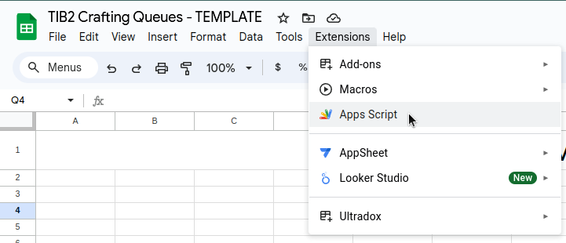
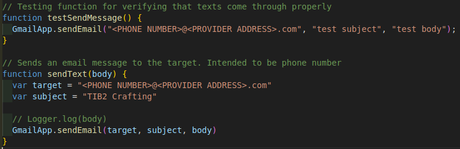
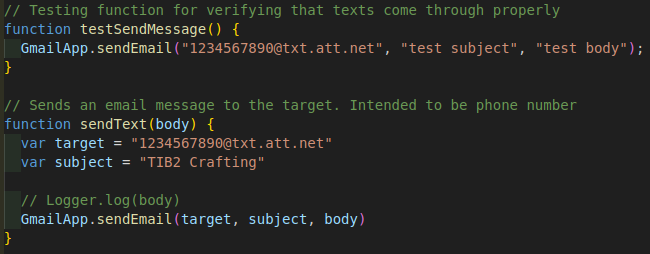

# Setup Guide for TIB2 Crafting Spreadsheet with Google Sheets

To get started, open and copy the [template spreadsheet](https://docs.google.com/spreadsheets/d/1bQMAnbaLsGb_eGIJ-JjZxMx5i0tMTdRWmXUZIEI8Pn4/edit?usp=sharing) to your Google Drive.

There are two ways to utilize the provided spreadsheet: with or without background scripts. Background scripts enable a lot of the automated functions of the spreadsheet such as resetting timers and sending notifications for item completion. While the spreadsheet can still be used without the scripts, setup and maintenance is a far more manual process.

**If you'd like to continue WITHOUT scripts, open the [No Script Setup](no_script_setup.md) guide and continue there. Otherwise, continue reading below...**

## Script installation and setup

From your spreadsheet that you copied, open the Apps Script extension from the toolbar

A new tab will open with an editor. Delete the existing code and copy/paste the [new code found here](spreadsheet_macros.gs) into the editor

Next you will need to make a couple small edits to the script to add your phone number or email for notifications. Near the end of the file, locate these lines of code:

Two lines will have `<PHONE NUMBER>@<PROVIDER ADDRESS>.com` in them. Update these to your 10-digit phone number and provider address (or your email). Make sure to keep the quotation marks around the text.

For example:

##### Different Cell Providers' Email-to-SMS Addresses

- AT&T: number@txt.att.net (SMS), number@mms.att.net (MMS)
- Boost Mobile: number@sms.myboostmobile.com (SMS), number@myboostmobile.com (MMS)
- C-Spire: number@cspire1.com
- Consumer Cellular: number@mailmymobile.net
- Cricket: number@sms.cricketwireless.net (SMS), number@mms.cricketwireless.net (MMS)
- Google Fi (Project Fi): number@msg.fi.google.com (SMS & MMS)
- H2O Wireless: number@txt.att.net (SMS), number@mms.att.net (MMS)
- Metro by T-Mobile: number@mymetropcs.com (SMS & MMS)
- Mint Mobile: number@mailmymobile.net (SMS)
- Page Plus: number@vtext.com (SMS), number@mypixmessages.com (MMS)
- Red Pocket: Red Pocket uses AT&T or T-Mobile (for GSM SIMs) & Verizon for CDMA. See info. for those carriers.
- Republic Wireless: number@text.republicwireless.com (SMS)
- Simple Mobile: number@smtext.com (SMS)
- Sprint: number@messaging.sprintpcs.com (SMS), number@pm.sprint.com (MMS)
- T-Mobile: number@tmomail.net (SMS & MMS)
- Ting: number@message.ting.com (SMS for CDMA), number@tmomail.net (SMS for GSM)
- Tracfone: number@mmst5.tracfone.com (MMS)
- Ultra Mobile: number@mailmymobile.net
- U.S. Cellular: number@email.uscc.net (SMS), number@mms.uscc.net (MMS)
- U.S. Mobile: number@vtext.com (SMS), number@mypixmessages.com (MMS)
- Verizon: number@vtext.com (SMS), number@vzwpix.com (MMS)
- Virgin Mobile: number@vmobl.com (SMS), number@vmpix.com (MMS)
- Visible: number@vtext.com (SMS), number@vzwpix.com (MMS)
- Xfinity Mobile: number@vtext.com (SMS), number@mypixmessages.com (MMS)

These are US providers. If your cell provider isn't listed here, you can search for the address by Googling "[YOUR CELL PROVIDER] email to sms address"

## Initializing the spreadsheet

## Updating/Maintaining the spreadsheet

